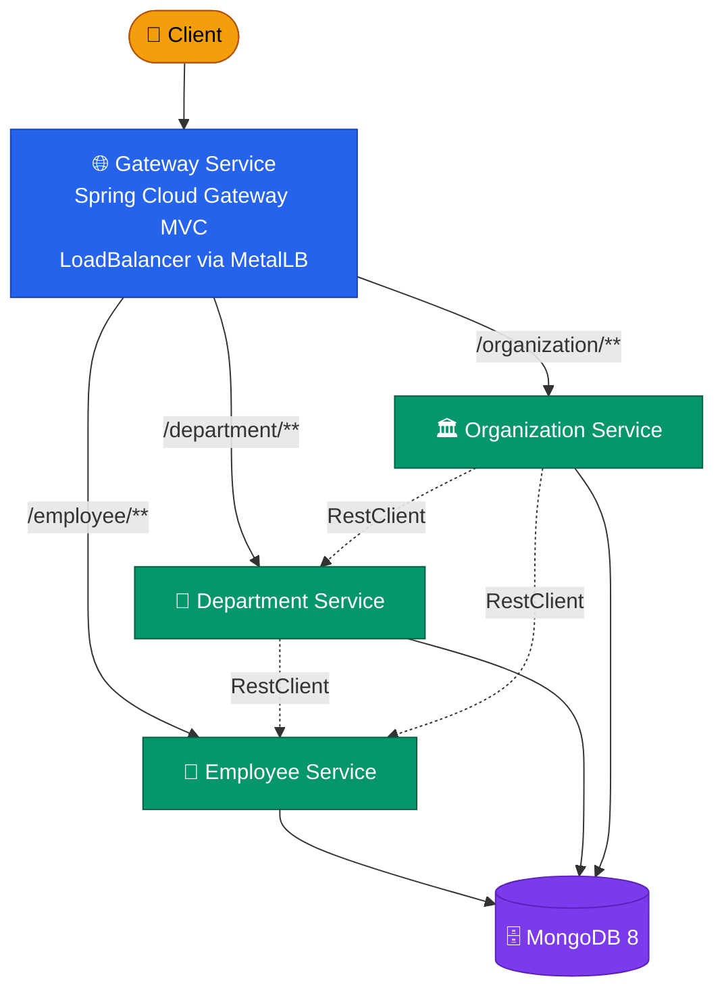

[](https://github.com/AndriyKalashnykov/spring-microservices-k8s/actions/workflows/ci.yml)
[](https://hits.sh/github.com/AndriyKalashnykov/spring-microservices-k8s/)
[](https://opensource.org/licenses/MIT)
[](https://app.renovatebot.com/dashboard#github/AndriyKalashnykov/spring-microservices-k8s)

# Java Microservices with Spring Boot and Spring Cloud Kubernetes

This reference architecture demonstrates design, development, and deployment of Spring Boot microservices on Kubernetes. It implements a hierarchical domain model (Organization > Department > Employee) with four services deployed across isolated namespaces, using Spring Cloud Kubernetes for service discovery, configuration, and secrets management.

| Component | Technology |
|-----------|-----------|
| Language | Java 25 |
| Framework | Spring Boot 4.0, Spring Cloud 2025.1 |
| API Gateway | Spring Cloud Gateway MVC |
| Inter-service | RestClient with `@HttpExchange` |
| Service Discovery | Spring Cloud Kubernetes |
| Database | MongoDB 8.0 (official `mongo` image, non-root UID 999, version-pinned) |
| API Docs | SpringDoc OpenAPI 2.8 / Swagger UI |
| Tracing | Micrometer Tracing (Brave) |
| Testing | Testcontainers (integration), Kind e2e |
| Containers | Eclipse Temurin 25, multi-arch (amd64+arm64) |
| Local K8s | Kind + MetalLB |
| CI/CD | GitHub Actions, Renovate, GHCR |
| Code Quality | Google Java Format, Checkstyle, hadolint, gitleaks, Trivy |



## Quick Start

```bash
make deps          # check required tools
make build         # build all modules with Maven
make kind-create   # create local Kind cluster with MetalLB
make kind-setup    # configure namespaces, RBAC, deploy MongoDB
make kind-deploy   # build images, load into Kind, deploy services
make e2e-test      # run end-to-end API tests
make gateway-open  # open Swagger UI in browser
```

## Prerequisites

| Tool | Version | Purpose |
|------|---------|---------|
| [GNU Make](https://www.gnu.org/software/make/) | 3.81+ | Build orchestration |
| [Git](https://git-scm.com/) | 2.0+ | Version control |
| [JDK](https://adoptium.net/) | 25 | Java runtime and compiler (source of truth: [`.java-version`](.java-version)) |
| [Maven](https://maven.apache.org/) | 3.9+ | Build and dependency management (pinned: `MAVEN_VER` in [Makefile](Makefile)) |
| [Docker](https://www.docker.com/) | 20.10+ | Container runtime |
| [kubectl](https://kubernetes.io/docs/tasks/tools/) | 1.24+ | Kubernetes CLI |
| [Kind](https://kind.sigs.k8s.io/) | 0.31+ | Local Kubernetes clusters (auto-installed by `make deps-kind`) |
| [SDKMAN](https://sdkman.io/) | latest | Java/Maven version management (optional, used by `make deps-install`) |

Verify required tools are installed:

```bash
make deps
```

To install Java 25 and Maven via SDKMAN automatically:

```bash
make deps-install
```

## Available Make Targets

Run `make help` to see all available targets.

### Build & Run

| Target | Description |
|--------|-------------|
| `make build` | Build all modules with Maven (skip tests) |
| `make clean` | Clean all build artifacts |
| `make test` | Run tests |
| `make format` | Auto-format Java source code (Google style) |
| `make format-check` | Verify code formatting (CI gate) |

### Code Quality

| Target | Description |
|--------|-------------|
| `make static-check` | Run all quality and security checks (format-check, lint-ci, lint, lint-docker, secrets, trivy-fs, trivy-config) |
| `make lint` | Run Maven validate, compiler warnings-as-errors, and Checkstyle (google_checks.xml) |
| `make lint-ci` | Lint GitHub Actions workflows with actionlint (uses shellcheck) |
| `make lint-docker` | Lint all Dockerfiles with hadolint |
| `make secrets` | Scan for hardcoded secrets |
| `make trivy-fs` | Scan filesystem for vulnerabilities, secrets, and misconfigurations |
| `make trivy-config` | Scan Kubernetes manifests for security misconfigurations (KSV-*) |
| `make mermaid-lint` | Validate Mermaid diagrams in markdown files via [mermaid-cli](https://github.com/mermaid-js/mermaid-cli) |
| `make cve-check` | Run OWASP dependency vulnerability scan |
| `make coverage-generate` | Generate code coverage report |
| `make coverage-check` | Verify code coverage meets minimum threshold |
| `make coverage-open` | Open code coverage report in browser |

### Docker

| Target | Description |
|--------|-------------|
| `make image-build` | Build Docker images for all services |
| `make image-load` | Load Docker images into KinD cluster |

### Kind Cluster

| Target | Description |
|--------|-------------|
| `make kind-create` | Create local KinD cluster with MetalLB |
| `make kind-setup` | Create namespaces, RBAC, service accounts, and deploy MongoDB |
| `make kind-deploy` | Build, load images, deploy all services, and wait for rollout |
| `make kind-undeploy` | Remove all services from KinD cluster |
| `make kind-redeploy` | Undeploy then deploy all services |
| `make kind-destroy` | Delete KinD cluster |

### E2E Testing

| Target | Description |
|--------|-------------|
| `make e2e` | Run full end-to-end test cycle (create, setup, deploy, test, destroy) |
| `make e2e-test` | Run end-to-end test script |
| `make populate` | Populate test data via gateway |

### Utilities

| Target | Description |
|--------|-------------|
| `make help` | List all available targets |
| `make gateway-url` | Print gateway LoadBalancer URL |
| `make gateway-open` | Open Swagger UI in browser |
| `make logs-employee` | Tail employee service logs |
| `make logs-department` | Tail department service logs |
| `make logs-organization` | Tail organization service logs |
| `make logs-gateway` | Tail gateway service logs |

### CI

| Target | Description |
|--------|-------------|
| `make ci` | Run full local CI pipeline (deps, static-check, coverage, build, deps-prune-check) |
| `make ci-run` | Run GitHub Actions workflow locally via [act](https://github.com/nektos/act) |
| `make release VERSION=x.y.z` | Create a release (usage: `make release VERSION=x.y.z`) |
| `make maven-settings-ossindex` | Create Maven settings for OSS Index credentials |

### Dependencies

| Target | Description |
|--------|-------------|
| `make deps` | Check required tools (java 25, mvn) |
| `make deps-install` | Install Java and Maven via SDKMAN |
| `make deps-maven` | Install Maven if not present (for CI containers) |
| `make deps-check` | Show required tools and installation status |
| `make deps-docker` | Check Docker and kubectl |
| `make deps-kind` | Install KinD for local Kubernetes testing |
| `make deps-act` | Install act for local CI runs |
| `make deps-hadolint` | Install hadolint for Dockerfile linting |
| `make deps-gitleaks` | Install gitleaks for secret scanning |
| `make deps-trivy` | Install Trivy for vulnerability and misconfig scanning |
| `make deps-actionlint` | Install actionlint for GitHub Actions linting |
| `make deps-shellcheck` | Install shellcheck (used by actionlint) |
| `make deps-updates` | Print project dependencies updates |
| `make deps-update` | Update project dependencies to latest releases |
| `make deps-prune` | Check for unused Maven dependencies |
| `make deps-prune-check` | Fail if unused/undeclared Maven dependencies are present (CI gate) |

### Renovate

| Target | Description |
|--------|-------------|
| `make renovate-bootstrap` | Install nvm and npm for Renovate |
| `make renovate-validate` | Validate Renovate configuration |

## Architecture

> See the full [Reference Architecture](docs/reference-architecture.md) for detailed diagrams and configuration.

This architecture follows Cloud Native best practices and [The 12 Factor App](https://12factor.net/) methodology. Key concerns addressed:

- **Externalized configuration** using ConfigMaps, Secrets, and PropertySource
- **Kubernetes API access** using ServiceAccounts, Roles, and RoleBindings
- **Health checks** using readiness, liveness, and startup probes
- **Application state** reported via Spring Boot Actuators
- **Service discovery** across namespaces using Spring Cloud Kubernetes DiscoveryClient
- **Inter-service communication** via RestClient (`@HttpExchange`)
- **API documentation** exposed via Swagger UI
- **Docker images** built with layered JARs using the Spring Boot plugin
- **Observability** via Prometheus exporters
- **Static analysis** via Checkstyle, hadolint, and gitleaks

### Service Communication

```
Client -> Gateway (Spring Cloud Gateway MVC, LoadBalancer via MetalLB)
  |-- /employee/**     -> Employee Service (MongoDB)
  |-- /department/**   -> Department Service (MongoDB, calls Employee via RestClient)
  +-- /organization/** -> Organization Service (MongoDB, calls Department + Employee via RestClient)
```

Each service runs in its own Kubernetes namespace with dedicated service accounts and RBAC role bindings for cross-namespace discovery.

## CI/CD

GitHub Actions runs on every push to `master`, tags `v*`, and pull requests.

| Job | Triggers | Steps |
|-----|----------|-------|
| **static-check** | push, PR | `make static-check` composite gate: format-check, lint-ci (actionlint), lint (Checkstyle + compiler warnings-as-errors), lint-docker (hadolint), secrets (gitleaks), trivy-fs, trivy-config, mermaid-lint |
| **build** | after static-check | Build all modules with Maven, upload JARs as `service-jars` artifact |
| **test** | after static-check | Run Testcontainers integration tests + coverage (non-blocking) |
| **cve-check** | push to master AND tag pushes (skipped under `act`) | OWASP dependency vulnerability scan — gates the `docker` job on tag pushes |
| **image-scan** | every push (matrix: 4 services) | Per-service Dockerfile validation gates 1–3: build single-arch image → Trivy image scan (CRITICAL/HIGH blocking) → Spring Boot boot-marker smoke test. Catches base-image CVE regressions and Dockerfile breakages on the commit that introduced them, not on release day. |
| **e2e** | every push (skipped under `act`) | End-to-end test against a full Kind + MetalLB stack: `make e2e` cycles create → setup (MongoDB) → deploy (4 services + gateway LB) → `./e2e/e2e-test.sh` → destroy. |
| **docker** | tag push only (matrix: 4 services) | Full pre-push hardening: build local image → Trivy image scan → Spring Boot smoke test → multi-arch (amd64+arm64) build with SLSA provenance + SBOM attestation → push to GHCR → cosign keyless OIDC signing. Depends on `build`, `test`, `cve-check`. |
| **ci-pass** | always | Branch-protection aggregator: single required status check that verifies no upstream job failed. Skipped jobs do not trip the gate. |

### Pre-push image hardening

The `docker` job runs the following gates **before** any image is pushed to GHCR. Any failure blocks the release.

| # | Gate | Catches | Tool |
|---|---|---|---|
| 1 | Build local single-arch image | Build regressions on the runner architecture | `docker/build-push-action` with `load: true` |
| 2 | **Trivy image scan** (CRITICAL/HIGH blocking) | CVEs in the base image (`eclipse-temurin:25-jre-noble`), OS packages, and any layers added during the build that the filesystem scan can't see | `aquasecurity/trivy-action` with `image-ref:` |
| 3 | **Spring Boot boot-marker smoke test** | Image is well-formed: JVM starts, Spring context boots, embedded Tomcat begins listening (greps the container logs for `Started <Service>Application in N.NN seconds` within 90s — no MongoDB needed since we don't gate on `/actuator/health`) | `docker run` + `docker logs` + `grep` |
| 4 | Multi-arch build + push | Publishes for both `linux/amd64` and `linux/arm64`. Mostly cache-hit from gate 1. | `docker/build-push-action` |
| 5 | **SLSA L2 build provenance** (`provenance: mode=max`) | Cryptographic record of how the image was built (commit, builder, build args). Verifiable via the OCI manifest. | `docker/build-push-action` native attestation |
| 6 | **SBOM attestation** (`sbom: true`) | Software Bill of Materials embedded in the image manifest as an attestation, auditable by Trivy/Grype/Syft consumers | `docker/build-push-action` native attestation |
| 7 | **Cosign keyless OIDC signing** | Sigstore signature on the manifest digest with no long-lived private keys (uses GitHub OIDC → Fulcio → Rekor) | `sigstore/cosign-installer` + `cosign sign --yes` |

Verify a published image's signature with:

```bash
cosign verify ghcr.io/AndriyKalashnykov/spring-microservices-k8s/employee:2.0.0 \
  --certificate-identity-regexp 'https://github\.com/AndriyKalashnykov/spring-microservices-k8s/.+' \
  --certificate-oidc-issuer https://token.actions.githubusercontent.com
```

Note: GHCR's Packages UI shows extra `unknown/unknown` rows alongside the platform manifests — these are the attestation manifests (SLSA provenance + SBOM). They're cosmetic; `docker pull` works identically.

Integration tests use [Testcontainers](https://testcontainers.com/) with MongoDB for fast local testing via `make test`.
End-to-end tests validate the full stack on Kind via `make e2e`.

### Required Secrets and Variables

| Name | Type | Used by | How to obtain |
|------|------|---------|---------------|
| `NVD_API_KEY` | Secret | `cve-check` job | Free API key from [NIST NVD](https://nvd.nist.gov/developers/request-an-api-key). Without it, OWASP dependency-check is heavily rate-limited. |
| `OSS_INDEX_USER` | Secret | `cve-check` job | Free account at [Sonatype OSS Index](https://ossindex.sonatype.org/user/signin). Your email address. Optional — improves vulnerability data quality. |
| `OSS_INDEX_TOKEN` | Secret | `cve-check` job | API token from [OSS Index settings](https://ossindex.sonatype.org/user/settings). Optional — paired with `OSS_INDEX_USER`. |
| `ACT` | Variable | `cve-check` job | Set to `true` to skip the `cve-check` job during local `act` runs (set automatically by `make ci-run`). |

Set secrets via **Settings > Secrets and variables > Actions > New repository secret**.
Set variables via **Settings > Secrets and variables > Actions > Variables tab > New repository variable**.

A weekly [cleanup workflow](.github/workflows/cleanup-runs.yml) prunes old workflow runs and stale caches.

[Renovate](https://docs.renovatebot.com/) keeps dependencies up to date with platform automerge enabled.

## Stargazers over time

[](https://starchart.cc/AndriyKalashnykov/spring-microservices-k8s)
