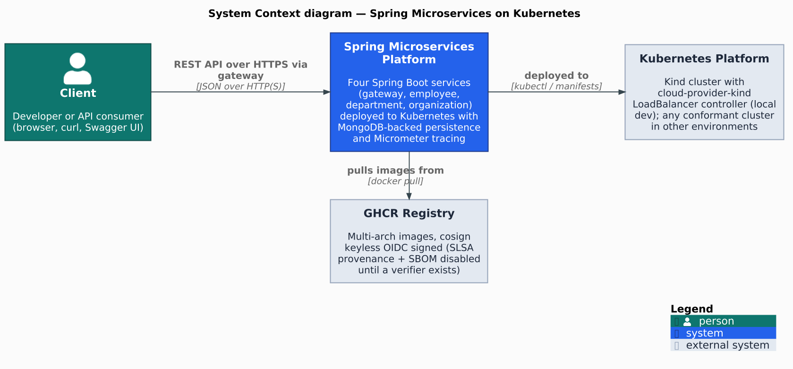
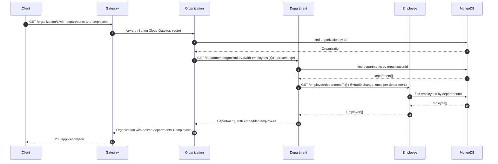

[](https://github.com/AndriyKalashnykov/spring-microservices-k8s/actions/workflows/ci.yml)
[](https://hits.sh/github.com/AndriyKalashnykov/spring-microservices-k8s/)
[](https://opensource.org/licenses/MIT)
[](https://app.renovatebot.com/dashboard#github/AndriyKalashnykov/spring-microservices-k8s)

# Runnable Spring Boot 4 Microservices on Kind

Reference implementation of four Spring Boot 4 microservices — gateway, organization, department, employee — deployed to a local Kind cluster in one command, with Spring Cloud Kubernetes cross-namespace service discovery.

The **runtime surface** is a Spring Cloud Gateway fronting REST services that call each other through declarative `@HttpExchange` clients, persist to MongoDB, and emit W3C-`traceparent` spans via Micrometer → OpenTelemetry OTLP → Jaeger, with Actuator health probes and a unified Swagger UI. The **delivery surface** is a Maven multi-module build, a `make static-check` composite quality gate, a three-layer test pyramid (Surefire unit → Testcontainers integration → full Kind e2e), and a hardened GHCR image pipeline (Trivy image scan + Spring Boot smoke test + container-structure-test + cosign keyless OIDC signing) — all from a mise-pinned toolchain with Renovate-managed dependencies, driven by `make kind-up` / `make ci` / `make kind-down`.

<p align="center"></p>

Source: [`docs/diagrams/c4-context.puml`](docs/diagrams/c4-context.puml) — PlantUML + [C4-PlantUML](https://github.com/plantuml-stdlib/C4-PlantUML) with a modern flat skinparam block (no shadows, sharp corners, Inter font, teal/indigo/violet palette). The full Container and Deployment views live in [`docs/reference-architecture.md`](docs/reference-architecture.md). Regenerate with `make diagrams`.

| Component | Technology | Rationale |
|-----------|-----------|-----------|
| Language | Java 25 | Current LTS release (Oracle/Temurin 2-year LTS cadence, supported into 2033); virtual threads + pattern matching + records make Spring Boot 4 code terser and more concurrent |
| Framework | Spring Boot 4.1, Spring Cloud 2025.1.2 | Mainstream Java microservices stack; Spring Boot 4 drops Spring Boot 2.x compat, adopts Jakarta EE 10, cleaner auto-configuration |
| API Gateway | Spring Cloud Gateway Server WebMVC | Servlet-stack gateway (not reactive WebFlux) — simpler mental model, easier to instrument, matches the blocking RestClient used elsewhere |
| Inter-service | RestClient with `@HttpExchange` | Native Spring declarative HTTP client; replaces Feign without pulling Netflix OSS; works with Spring Cloud LoadBalancer for service-discovery-aware calls |
| Service Discovery | Spring Cloud Kubernetes | Uses the Kubernetes API as the registry — no Eureka/Consul to operate; `all-namespaces: true` enables cross-namespace discovery |
| Database | MongoDB 8.0 LTS (official `mongo` image, non-root UID 999, version-pinned) | Document model fits the Organization → Department → Employee aggregates without a migration toolchain; pinned to the 8.0 **LTS** line (EOL 2029-10-31) over the short-lived rapid-release lines, Renovate-tracked within 8.0.x |
| API Docs | SpringDoc OpenAPI 3.0 / Swagger UI | Auto-generates OpenAPI 3 from `@RestController` annotations; gateway surfaces a unified Swagger UI across all services |
| Tracing | Micrometer Tracing → OpenTelemetry OTLP → Jaeger | Spans propagate across all four services via W3C `traceparent`, export over OTLP/HTTP to in-cluster Jaeger (`observability` namespace); UI via `make jaeger-open` |
| Testing | Surefire (unit), Testcontainers (integration), Kind (e2e) | Three-layer pyramid: Surefire `*Test` for in-process controller slices, Failsafe `*IT` with real MongoDB per class (no mocking), real Kind cluster for e2e — catches schema drift and manifest bugs that in-process tests miss |
| Containers | Eclipse Temurin 25, multi-arch (amd64+arm64) | Temurin is the reference OpenJDK build; multi-arch covers Apple Silicon dev + x86 servers from a single manifest |
| Local K8s | Kind + cloud-provider-kind | Kind runs a real Kubernetes API in Docker — higher fidelity than Minikube; cloud-provider-kind (kind-team maintained, lives in `kubernetes-sigs/`) runs host-side and allocates LoadBalancer IPs on the `kind` Docker network. Supersedes MetalLB — simpler lifecycle, no in-cluster footprint, kindest/node bumps supported day-one |
| CI/CD | GitHub Actions, Renovate, GHCR | GitHub-native, zero extra infrastructure; Renovate auto-merges minor/patch dependency updates; GHCR avoids Docker Hub pull-rate limits |
| Code Quality | google-java-format, Checkstyle, hadolint, gitleaks, actionlint, Trivy, PlantUML, Mermaid lint | Composite `make static-check` gate — toolchain-alignment + format + lint + Dockerfile lint + secret scan + workflow lint + filesystem/K8s config CVE scan + PlantUML & Mermaid diagram drift — fails the build on any single violation |

## Quick Start

```bash
make deps          # install mise + the pinned toolchain
make kind-up       # full cluster lifecycle: Kind + cloud-provider-kind + MongoDB + Jaeger + 4 services
make e2e-test      # run end-to-end API tests
make gateway-open  # open Swagger UI in browser
make kind-down     # tear everything down when finished
```

`make kind-up` is an alias for `make kind-deploy` that chains
`kind-create` → `kind-setup` → `image-build` → `image-load` → service
deployment. See the [granular targets](#kind-cluster) below if you need to
run individual steps (e.g., to skip the image rebuild during iterative
development).

## Prerequisites

| Tool | Version | Purpose |
|------|---------|---------|
| [GNU Make](https://www.gnu.org/software/make/) | 3.81+ | Build orchestration |
| [Git](https://git-scm.com/) | 2.0+ | Version control |
| [mise](https://mise.jdx.dev/) | latest | Polyglot version manager — installs Java, Maven, Node, kind, act, hadolint, gitleaks, trivy, actionlint, shellcheck from [`.mise.toml`](.mise.toml) (auto-installed by `make deps`) |
| [Docker](https://www.docker.com/) | 20.10+ | Container runtime |
| [kubectl](https://kubernetes.io/docs/tasks/tools/) | 1.24+ | Kubernetes CLI |

`make deps` bootstraps mise (if missing) and installs the entire toolchain pinned in `.mise.toml` — a single command per fresh checkout. CI uses [`jdx/mise-action`](https://github.com/jdx/mise-action) to do the same.

Verify required tools are installed:

```bash
make deps
```

## Architecture

This architecture follows Cloud Native best practices and [The 12 Factor App](https://12factor.net/) methodology. Key concerns addressed:

- **Externalized configuration** using ConfigMaps, Secrets, and PropertySource
- **Kubernetes API access** using ServiceAccounts, Roles, and RoleBindings
- **Health checks** using readiness, liveness, and startup probes
- **Application state** reported via Spring Boot Actuators
- **Service discovery** across namespaces using Spring Cloud Kubernetes DiscoveryClient
- **Inter-service communication** via RestClient (`@HttpExchange`)
- **API documentation** exposed via Swagger UI
- **Docker images** built with layered JARs using the Spring Boot plugin
- **Observability** via Prometheus exporters + distributed tracing (Micrometer → OTLP → Jaeger)
- **Static analysis** via google-java-format, Checkstyle, hadolint, gitleaks, actionlint, Trivy (filesystem + K8s config), PlantUML & Mermaid diagram drift checks, and a toolchain-alignment guard — all wired into the `make static-check` composite gate

### Service Communication

```text
Client -> Gateway (Spring Cloud Gateway Server WebMVC, LoadBalancer via cloud-provider-kind)
  |-- /employee/**     -> Employee Service (MongoDB)
  |-- /department/**   -> Department Service (MongoDB, calls Employee via RestClient)
  +-- /organization/** -> Organization Service (MongoDB, calls Department + Employee via RestClient)
```

Each service runs in its own Kubernetes namespace with dedicated service accounts and RBAC role bindings for cross-namespace discovery.

### Deep fan-out flow

`GET /organization/{id}/with-departments-and-employees` hits three services and the datastore in a single request. The sequence:



Steps 2–13 all happen inside the cluster via ClusterIP Services resolved through Spring Cloud Kubernetes `DiscoveryClient`. The client sees only the outer request (1) and the final response (14). Trace headers (`traceparent`) propagate through every hop via Micrometer Tracing.

See the full [Reference Architecture](docs/reference-architecture.md) for the Deployment diagram, Kubernetes DNS table, and per-manifest configuration details, and [Architecture Decision Records](docs/adr/) for the rationale behind key choices.

## API

The gateway exposes a unified surface on `http://<GATEWAY_IP>:8080` (allocated by cloud-provider-kind on the `kind` Docker network). Fetch the IP with `make gateway-url`, then:

```bash
GATEWAY=$(make --silent gateway-url)

# Seed some data
make populate

# Employees CRUD
curl -s "http://$GATEWAY:8080/employee/"
curl -s "http://$GATEWAY:8080/employee/department/1"

# Cross-service fan-out — organization 1, fully expanded with departments + employees
curl -s "http://$GATEWAY:8080/organization/1/with-departments-and-employees" | jq
```

A complete OpenAPI 3 spec plus Swagger UI is served through the gateway — run `make gateway-open` to launch it, or point a browser at `http://<GATEWAY_IP>:8080/swagger-ui/index.html`. See [`e2e/e2e-test.sh`](e2e/e2e-test.sh) for exhaustive end-to-end assertions across every route.

## Deployment

Local Kubernetes deployment is driven by the Makefile — `make kind-up` spins up the full stack in one command:

```bash
make kind-up       # Kind cluster + cloud-provider-kind + MongoDB + Jaeger + 4 services (~2–3 min)
make gateway-url   # print LoadBalancer IP allocated by cloud-provider-kind
make gateway-open  # open Swagger UI in a browser
make jaeger-open   # open Jaeger tracing UI in a browser
make kind-down     # tear everything down
```

Under the hood `kind-up` chains `kind-create` (cluster + cloud-provider-kind) → `kind-setup` (namespaces, RBAC, MongoDB, Jaeger) → `image-build` → `image-load` → `kind-deploy` (rollout all 4 services). See [Kind Cluster targets](#kind-cluster) for running each step in isolation during iterative development.

Production deployment is out of scope for this reference — the manifests under [`k8s/`](k8s/) are tuned for a single-node local Kind cluster. See [`docs/reference-architecture.md`](docs/reference-architecture.md) for the annotated manifests and the rationale behind each ConfigMap / Secret / RBAC binding.

## Available Make Targets

Run `make help` to see all available targets.

### Build & Run

| Target | Description |
|--------|-------------|
| `make build` | Build all modules with Maven (skip tests) |
| `make clean` | Clean all build artifacts |
| `make format` | Auto-format Java source code (Google style) |
| `make format-check` | Verify code formatting (CI gate) |

### Testing

Three-layer test pyramid: unit → integration → end-to-end. Each layer runs in isolation so contributors can pick the fastest layer that catches their change.

| Target | Layer | Runtime | What it covers |
|--------|-------|---------|----------------|
| `make test` | Unit + in-process controller | seconds | Surefire: `**/*Test.java` — pure unit + `@WebMvcTest`-style slices; no Docker |
| `make integration-test` | Testcontainers | tens of seconds | Failsafe: `**/*IT.java` — real MongoDB (+ WireMock) per test class; requires Docker |
| `make e2e` | Full Kind cluster | minutes | Full cycle: kind-create → kind-setup → kind-deploy → `e2e/e2e-test.sh` → kind-destroy |
| `make e2e-test` | — | seconds | Run `e2e/e2e-test.sh` against an already-running cluster (skips cycle) |
| `make populate` | — | seconds | Seed sample data via gateway (used by `e2e-test` and manual exploration) |

### Code Quality

| Target | Description |
|--------|-------------|
| `make static-check` | Run all quality and security checks (format-check, diagrams-check, mermaid-lint, lint-ci, lint, lint-docker, secrets, trivy-fs, trivy-config) |
| `make lint` | Run Maven validate, compiler warnings-as-errors, and Checkstyle (google_checks.xml) |
| `make lint-ci` | Lint GitHub Actions workflows with actionlint (uses shellcheck) |
| `make lint-docker` | Lint all Dockerfiles with hadolint |
| `make secrets` | Scan for hardcoded secrets |
| `make trivy-fs` | Scan filesystem for vulnerabilities, secrets, and misconfigurations |
| `make trivy-config` | Scan Kubernetes manifests for security misconfigurations (KSV-*) |
| `make diagrams` | Render PlantUML architecture diagrams under `docs/diagrams/` to PNG |
| `make diagrams-check` | Verify committed PNGs match current `.puml` source (drift check for CI) |
| `make diagrams-clean` | Remove rendered diagram PNGs |
| `make container-structure-test` | Validate Dockerfile contracts (USER, EXPOSE, ENTRYPOINT) on built images |
| `make cve-check` | Run OWASP dependency vulnerability scan |
| `make coverage-generate` | Generate code coverage report |
| `make coverage-check` | Verify code coverage meets minimum threshold |
| `make coverage-open` | Open code coverage report in browser |

### Docker

| Target | Description |
|--------|-------------|
| `make image-build` | Build Docker images for all services |
| `make image-load` | Load Docker images into KinD cluster |

### Kind Cluster

| Target | Description |
|--------|-------------|
| `make kind-up` | **Full cluster lifecycle** (alias for `kind-deploy`): create + cloud-provider-kind + setup + image build + deploy |
| `make kind-down` | **Tear down** the Kind cluster (alias for `kind-destroy`) |
| `make kind-create` | Create local KinD cluster with cloud-provider-kind LoadBalancer controller (granular) |
| `make kind-setup` | Create namespaces, RBAC, service accounts, and deploy MongoDB (granular) |
| `make kind-deploy` | Build, load images, deploy all services, and wait for rollout (granular) |
| `make kind-undeploy` | Remove all services from KinD cluster (keeps cluster running) |
| `make kind-redeploy` | Undeploy then deploy all services |
| `make kind-destroy` | Delete KinD cluster (granular) |

### Utilities

| Target | Description |
|--------|-------------|
| `make help` | List all available targets |
| `make gateway-url` | Print gateway LoadBalancer URL |
| `make gateway-open` | Open Swagger UI in browser |
| `make jaeger-open` | Open Jaeger tracing UI in browser |
| `make logs-employee` | Tail employee service logs |
| `make logs-department` | Tail department service logs |
| `make logs-organization` | Tail organization service logs |
| `make logs-gateway` | Tail gateway service logs |

### CI

| Target | Description |
|--------|-------------|
| `make ci` | Run full local CI pipeline (deps, static-check, coverage, build, deps-prune-check) |
| `make ci-run` | Run GitHub Actions workflow locally via [act](https://github.com/nektos/act) |
| `make release VERSION=x.y.z` | Create a release (usage: `make release VERSION=x.y.z`) |
| `make maven-settings-ossindex` | Create Maven settings for OSS Index credentials |

### Dependencies

| Target | Description |
|--------|-------------|
| `make deps` | Ensure mise + the toolchain pinned in `.mise.toml` are installed (Java, Maven, Node, kind, act, hadolint, gitleaks, trivy, actionlint, shellcheck) |
| `make deps-install` | Alias for `deps` (kept for backwards compatibility) |
| `make deps-check` | Show required tools and installation status |
| `make deps-docker` | Check Docker (used by diagrams, mermaid-lint, image-build, Testcontainers) |
| `make deps-kubectl` | Check kubectl (required for Kind cluster targets) |
| `make deps-kind` | Ensure kind toolchain (mise installs kind; docker + kubectl verified) |
| `make deps-act` | Ensure act toolchain (mise installs act; docker verified) |
| `make deps-updates` | Print project dependencies updates |
| `make deps-update` | Update project dependencies to latest releases |
| `make deps-prune` | Check for unused Maven dependencies |
| `make deps-prune-check` | Fail if unused/undeclared Maven dependencies are present (CI gate) |

### Renovate

| Target | Description |
|--------|-------------|
| `make renovate-bootstrap` | Install mise + Node (per `.nvmrc`) for `renovate-validate` |
| `make renovate-validate` | Validate Renovate configuration |

## CI/CD

GitHub Actions runs on every push to `master`, tags `v*`, and pull requests.

| Job | Triggers | Steps |
|-----|----------|-------|
| **changes** | push, PR | Detects which classes of files changed (via `dorny/paths-filter`) and exposes `code` + `e2e` outputs. Heavy jobs are gated by these so doc-only PRs skip the full pipeline while still satisfying the `ci-pass` aggregator. |
| **static-check** | push, PR (when `code` changed) | `make static-check` composite gate: format-check, diagrams-check, mermaid-lint, lint-ci (actionlint), lint (Checkstyle + compiler warnings-as-errors), lint-docker (hadolint), secrets (gitleaks), trivy-fs, trivy-config |
| **build** | after static-check | Build all modules with Maven, upload JARs as `service-jars` artifact |
| **test** | after static-check | Surefire unit + in-process controller tests (`**/*Test.java`) with JaCoCo coverage |
| **integration-test** | after static-check | Failsafe Testcontainers integration tests (`**/*IT.java`) — real MongoDB per class plus WireMock for cross-service stubs |
| **cve-check** | tag pushes + weekly schedule + manual dispatch (skipped under `act`) | OWASP dependency vulnerability scan — gates the `docker` job on tag pushes. Off the per-push path (slow NVD feed, `continue-on-error`); blocking dependency-CVE coverage runs on every push via Trivy (`trivy-fs` + `image-scan`) |
| **image-scan** | every push (matrix: 4 services) | Per-service Dockerfile validation gates: build single-arch image → Trivy image scan (CRITICAL/HIGH blocking) → Spring Boot boot-marker smoke test → container-structure-test (OCI-manifest contract: USER non-root, EXPOSE, WORKDIR, ENTRYPOINT). Catches base-image CVE regressions, runtime breakages, and Dockerfile-contract drift on the commit that introduced them, not on release day. |
| **e2e** | push/PR when KinD-relevant files change (skipped under `act`) | End-to-end test against a full Kind + cloud-provider-kind stack: `make e2e` cycles create → setup (MongoDB) → deploy (4 services + gateway LB) → `./e2e/e2e-test.sh` → destroy. |
| **docker** | tag push only (matrix: 4 services) | Full pre-push hardening: build local image → Trivy image scan → Spring Boot smoke test → multi-arch (amd64+arm64) build → push to GHCR → cosign keyless OIDC signing. Depends on `build`, `test`, `cve-check`. |
| **ci-pass** | always | Branch-protection aggregator: single required status check that verifies no upstream job failed or was cancelled. Skipped jobs do not trip the gate. |

### Pre-push image hardening

The `docker` job runs the following gates **before** any image is pushed to GHCR. Any failure blocks the release.

| # | Gate | Catches | Tool |
|---|---|---|---|
| 1 | Build local single-arch image | Build regressions on the runner architecture | `docker/build-push-action` with `load: true` |
| 2 | **Trivy image scan** (CRITICAL/HIGH blocking) | CVEs in the base image (`eclipse-temurin:25-jre-noble`), OS packages, and any layers added during the build that the filesystem scan can't see | `aquasecurity/trivy-action` with `image-ref:` |
| 3 | **Spring Boot boot-marker smoke test** | Image is well-formed: JVM starts, Spring context boots, embedded Tomcat begins listening (greps the container logs for `Started <Service>Application in N.NN seconds` within 90s — no MongoDB needed since we don't gate on `/actuator/health`) | `docker run` + `docker logs` + `grep` |
| 4 | Multi-arch build + push | Publishes for both `linux/amd64` and `linux/arm64`. Mostly cache-hit from gate 1. | `docker/build-push-action` |
| 5 | **Cosign keyless OIDC signing** | Sigstore signature on the manifest digest with no long-lived private keys (uses GitHub OIDC → Fulcio → Rekor) | `sigstore/cosign-installer` + `cosign sign --yes` |

Verify a published image's signature with:

```bash
# Replace <tag> with a published tag (e.g. 2.2.0, 2.2, 2, latest)
cosign verify ghcr.io/AndriyKalashnykov/spring-microservices-k8s/employee:<tag> \
  --certificate-identity-regexp 'https://github\.com/AndriyKalashnykov/spring-microservices-k8s/.+' \
  --certificate-oidc-issuer https://token.actions.githubusercontent.com
```

Note: SLSA L2 build provenance and SBOM attestations (`provenance: mode=max` + `sbom: true`) are deliberately disabled. Buildx emits them as per-platform `unknown/unknown` manifest entries that GHCR's UI renders as if they were real platforms — a confusing cosmetic cost with no upside until a downstream consumer actually runs `cosign verify-attestation --type slsaprovenance` or `trivy image --sbom-from registry`. Flip them back on (Pattern B) the moment such a consumer is wired in.

Integration tests use [Testcontainers](https://testcontainers.com/) with MongoDB for fast local testing via `make integration-test`.
End-to-end tests validate the full stack on Kind via `make e2e`.

### Required Secrets and Variables

| Name | Type | Used by | How to obtain |
|------|------|---------|---------------|
| `NVD_API_KEY` | Secret | `cve-check` job | Free API key from [NIST NVD](https://nvd.nist.gov/developers/request-an-api-key). Without it, OWASP dependency-check is heavily rate-limited. |
| `OSS_INDEX_USER` | Secret | `cve-check` job | Free account at [Sonatype OSS Index](https://ossindex.sonatype.org/user/signin). Your email address. Optional — improves vulnerability data quality. |
| `OSS_INDEX_TOKEN` | Secret | `cve-check` job | API token from [OSS Index settings](https://ossindex.sonatype.org/user/settings). Optional — paired with `OSS_INDEX_USER`. |
| `ACT` | Variable | `cve-check` job | Set to `true` to skip the `cve-check` job during local `act` runs (set automatically by `make ci-run`). |

Set secrets via **Settings > Secrets and variables > Actions > New repository secret**.
Set variables via **Settings > Secrets and variables > Actions > Variables tab > New repository variable**.

A weekly [cleanup workflow](.github/workflows/cleanup-runs.yml) prunes old workflow runs and stale caches.

[Renovate](https://docs.renovatebot.com/) keeps dependencies up to date with platform automerge enabled.

## Contributing

Contributions welcome — open a PR. Run `make static-check` locally before pushing; the full pipeline is reproducible via `make ci` (and `make ci-run` to exercise the GitHub Actions workflow through [act](https://github.com/nektos/act)).

## License

[MIT](LICENSE).

## Stargazers over time

[](https://star-history.com/#AndriyKalashnykov/spring-microservices-k8s&Date)
