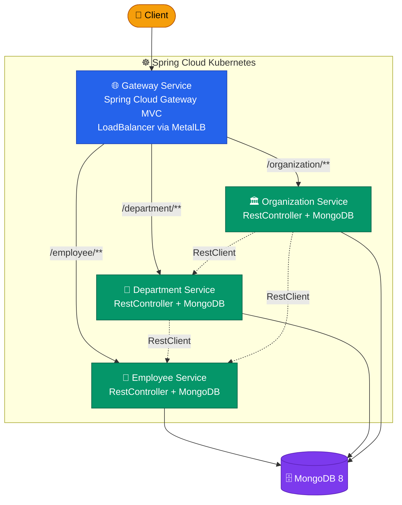
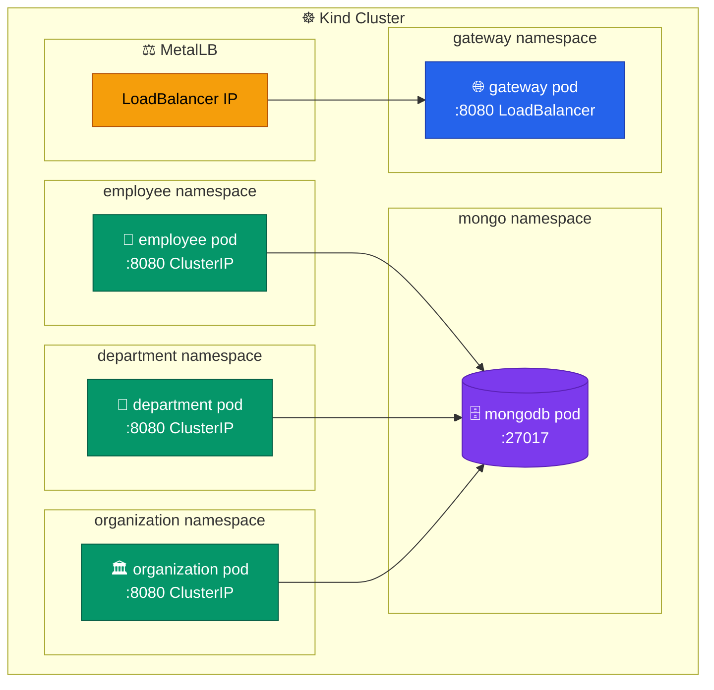
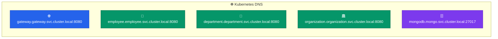

# Java Microservices with Spring Boot and Spring Cloud Kubernetes

## Abstract

This Reference Architecture demonstrates design, development, and deployment of
[Spring Boot](https://spring.io/projects/spring-boot) microservices on
Kubernetes. Each section covers architectural recommendations and configuration
for each concern when applicable.

High-level key recommendations:

- Consider Best Practices in Cloud Native Applications and [The 12
  Factor App](https://12factor.net/)
- Keep each microservice in a separate [Maven](https://maven.apache.org/) project
- Prefer using dependencies when inheriting from parent project instead of using
  relative path
- Use [Spring Initializr](https://start.spring.io/) to generate a Spring Boot
  project structure

This architecture demonstrates a complex Cloud Native application that
addresses the following concerns:

- Externalized configuration using ConfigMaps, Secrets, and PropertySource
- Kubernetes API server access using ServiceAccounts, Roles, and RoleBindings
- Health checks using Application Probes (readinessProbe, livenessProbe, startupProbe)
- Reporting application state using Spring Boot Actuators
- Service discovery across namespaces using DiscoveryClient
- Exposing API documentation using SpringDoc OpenAPI / Swagger UI
- Building a Docker image using best practices
- Layering JARs using the Spring Boot plugin
- Observing the application using Prometheus exporters

## Tech Stack

| Component | Version |
|-----------|---------|
| Java | 25 |
| Spring Boot | 4.0.5 |
| Spring Cloud | 2025.1.1 |
| Spring Cloud Kubernetes | 5.x (via 2025.1.1) |
| Spring Cloud Gateway Server WebMVC | 5.0.x |
| RestClient + @HttpExchange | Spring 7.x (native) |
| Micrometer Tracing | (managed by Spring Boot BOM) |
| Testcontainers | 2.0.x (managed by Spring Boot BOM) |
| Spring Cloud LoadBalancer | 5.0.x |
| SpringDoc OpenAPI | 3.0.2 |
| MongoDB | 8.0 (official `mongo` image, non-root UID 999) |
| Kubernetes | 1.35+ (Kind for local dev) |
| Kind | 0.31.0 |
| MetalLB | 0.15.3 |

## Reference Architecture

The reference architecture demonstrates an organization where each unit has its
own application designed using a microservices architecture. Microservices are
exposed as REST APIs utilizing Spring Boot in an embedded Tomcat server and
deployed on Kubernetes.

Each microservice is deployed in its own namespace. Placing microservices in
separate namespaces allows logical grouping that makes it easier to manage
access privileges. Spring Cloud Kubernetes Discovery Client makes internal
communication between microservices seamless by communicating with the
Kubernetes API to discover the IPs of all services running in Pods.

The application is built with these open source components:

- [Spring Cloud Kubernetes](https://github.com/spring-cloud/spring-cloud-kubernetes):
  Integration with the Kubernetes API server for service discovery,
  configuration and load balancing.
- [Spring Cloud Gateway MVC](https://docs.spring.io/spring-cloud-gateway/reference/spring-cloud-gateway-server-mvc.html):
  Servlet-based API gateway for routing requests to microservices.
- [RestClient](https://docs.spring.io/spring-framework/reference/integration/rest-clients.html#rest-http-interface) with `@HttpExchange`: Native Spring declarative HTTP client for inter-service communication, integrated with Spring Cloud LoadBalancer.
- [Spring Cloud LoadBalancer](https://docs.spring.io/spring-cloud-commons/reference/spring-cloud-commons/loadbalancer.html):
  Client-side load balancing via Kubernetes service discovery.
- [SpringDoc OpenAPI](https://springdoc.org/): OpenAPI 3 documentation with
  Swagger UI.



## Reference Architecture Environment

Each microservice runs in its own container, one container per pod and one pod
per service replica. The application uses a microservices architecture
with replicated containers calling each other.



## Spring Cloud Kubernetes

Spring Cloud Kubernetes provides Spring Cloud implementations of common
interfaces that consume Kubernetes native services. This Reference Architecture
demonstrates the use of the following features:

- Discovering services across all namespaces using DiscoveryClient
- Using ConfigMap and Secrets as Spring Boot property sources with
  `spring.config.import: "optional:kubernetes:"`
- Implementing health checks using Spring Cloud Kubernetes pod health indicator

## Source Code Directory Structure

```
spring-microservices-k8s/
├── department-service/    # Department microservice (calls Employee via RestClient)
│   └── src/
├── employee-service/      # Employee microservice (base CRUD service)
│   └── src/
├── gateway-service/       # API gateway (Spring Cloud Gateway MVC)
│   └── src/
├── organization-service/  # Organization microservice (calls Dept + Employee)
│   └── src/
├── k8s/                   # Kubernetes manifests, Kind + MetalLB configs
├── e2e/                   # End-to-end test script
├── docs/                  # Architecture documentation and diagrams
├── Makefile               # Build orchestration (run `make help`)
├── pom.xml                # Parent POM (multi-module)
└── renovate.json          # Renovate dependency update configuration
```

## Quick Start

```bash
make deps          # check required tools
make build         # build all modules with Maven
make kind-create   # create local Kind cluster with MetalLB
make kind-setup    # configure namespaces, RBAC, deploy MongoDB
make kind-deploy   # build images, load into Kind, deploy services
make e2e-test      # run end-to-end API tests
make gateway-open  # open Swagger UI in browser
```

## Enable Spring Cloud Kubernetes

Add the following dependency to enable Spring Cloud Kubernetes features. The
library provides service discovery, ConfigMap property sources, and load
balancing integration.

```xml
<dependency>
    <groupId>org.springframework.cloud</groupId>
    <artifactId>spring-cloud-starter-kubernetes-client-all</artifactId>
</dependency>
```

In Spring Boot 3.x, ConfigMap and Secret property loading requires explicit
opt-in via `spring.config.import`:

```yaml
# application.yml
spring:
  application:
    name: department
  config:
    import: "optional:kubernetes:"
  cloud:
    kubernetes:
      config:
        enabled: true
      discovery:
        all-namespaces: true
      secrets:
        enabled: true
        paths:
          - /etc/secretspot
```

## Enable Service Discovery Across All Namespaces

The `all-namespaces: true` setting in `application.yml` enables cross-namespace
discovery. This allows the gateway and inter-service RestClient calls to find
services deployed in different namespaces.

Application classes are streamlined in Spring Boot 3.x — annotations like
`@EnableDiscoveryClient`, `@EnableMongoRepositories`, and `@EnableSwagger2`
are no longer needed (auto-configured).

`/department-service/src/main/java/.../DepartmentApplication.java`

```java
@SpringBootApplication
public class DepartmentApplication {

    public static void main(String[] args) {
        SpringApplication.run(DepartmentApplication.class, args);
    }

    @Bean
    MeterRegistryCustomizer<MeterRegistry> meterRegistryCustomizer() {
        return registry -> registry.config()
                .commonTags("application", "department");
    }
}
```

RestClient with `@HttpExchange` is a native Spring declarative HTTP client. To
communicate with `employee-service` from `department-service`, create an
interface annotated with `@HttpExchange`. The service name `"employee"` is
resolved at runtime via Spring Cloud Kubernetes DiscoveryClient and
Spring Cloud LoadBalancer.

`/department-service/src/main/java/.../client/EmployeeClient.java`

```java
public interface EmployeeClient {
    @GetExchange("/department/{departmentId}")
    List<Employee> findByDepartment(@PathVariable String departmentId);
}
```

ConfigMap properties are loaded automatically when the ConfigMap name matches
`spring.application.name`:

`/k8s/department-configmap.yaml`

```yaml
kind: ConfigMap
apiVersion: v1
metadata:
  name: department
data:
  spring.cloud.kubernetes.discovery.all-namespaces: "true"
  spring.data.mongodb.database: "admin"
  spring.data.mongodb.host: "mongodb.mongo.svc.cluster.local"
  management.endpoints.web.exposure.include: "health,info,metrics,prometheus"
  management.metrics.enable.all: "true"
```

## Configure Spring Cloud Kubernetes to Access Kubernetes API

Spring Cloud Kubernetes requires access to the Kubernetes API to retrieve
service endpoints. A `ClusterRole` defines the required permissions:

`/k8s/rbac-cluster-role.yaml`

```yaml
kind: ClusterRole
apiVersion: rbac.authorization.k8s.io/v1
metadata:
  namespace: default
  name: microservices-kubernetes-namespace-reader
rules:
  - apiGroups: [""]
    resources: ["configmaps", "pods", "services", "endpoints", "secrets"]
    verbs: ["get", "list", "watch"]
```

The Makefile's `kind-setup` target automatically creates namespaces, service
accounts, and cluster role bindings:

```bash
make kind-setup
```

This creates 5 namespaces (department, employee, gateway, organization, mongo),
a service account `api-service-account` in each, and binds them to the
ClusterRole. All deployment manifests reference this service account.

## Kubernetes Service Naming

Every Service in the cluster is assigned a DNS name following the pattern
`<service>.<namespace>.svc.cluster.local`. For example, the MongoDB service
is reachable at `mongodb.mongo.svc.cluster.local:27017`.



The pattern is `<service>.<namespace>.svc.cluster.local:<port>`.

## Configure MongoDB

MongoDB 8 runs as a single-replica deployment in the `mongo` namespace.

`/k8s/mongodb-deployment.yaml` (abbreviated)

```yaml
apiVersion: apps/v1
kind: Deployment
metadata:
  name: mongodb
spec:
  replicas: 1
  template:
    spec:
      securityContext:
        # Official mongo image runs as the `mongodb` user (UID 999).
        runAsNonRoot: true
        runAsUser: 999
        runAsGroup: 999
        fsGroup: 999
      containers:
        - name: mongodb
          image: mongo:8.0.20
          ports:
            - containerPort: 27017
          env:
            # Official mongo image uses MONGO_INITDB_* env vars.
            - name: MONGO_INITDB_DATABASE
              valueFrom:
                configMapKeyRef:
                  name: mongodb
                  key: database-name
            - name: MONGO_INITDB_ROOT_USERNAME
              valueFrom:
                secretKeyRef:
                  name: mongodb
                  key: database-user
            - name: MONGO_INITDB_ROOT_PASSWORD
              valueFrom:
                secretKeyRef:
                  name: mongodb
                  key: database-password
          resources:
            requests:
              cpu: "0.2"
              memory: 300Mi
            limits:
              cpu: "1.0"
              memory: 300Mi
      serviceAccountName: api-service-account
```

Credentials are stored in a Kubernetes Secret (base64-encoded):

```yaml
apiVersion: v1
kind: Secret
metadata:
  name: mongodb
type: Opaque
data:
  database-user: bW9uZ28tYWRtaW4=           # mongo-admin
  database-password: bW9uZ28tYWRtaW4tcGFzc3dvcmQ=  # mongo-admin-password
```

## Use Secret Through Mounted Volume

> **Production recommendation**: Containers should share secrets through mounted
> volumes. Limit access to Secrets using
> [RBAC authorization](https://kubernetes.io/docs/concepts/configuration/secret/#best-practices).
> Secrets are not secure by themselves — they are merely obfuscation.

The MongoDB credentials Secret is mounted to `/etc/secretspot` in each service
container. Spring Cloud Kubernetes reads the key-value pairs from this path:

```yaml
# application.yml
spring:
  cloud:
    kubernetes:
      secrets:
        enabled: true
        paths:
          - /etc/secretspot
```

```yaml
# deployment manifest (abbreviated)
spec:
  containers:
    - name: department
      volumeMounts:
        - name: mongodb
          mountPath: /etc/secretspot
  volumes:
    - name: mongodb
      secret:
        secretName: department
```

## Use Spring Boot Actuator to Export Metrics for Prometheus

[Prometheus](https://prometheus.io/) monitoring integrates through
[Micrometer](http://micrometer.io/) and Spring Boot Actuator.

Maven dependencies:

```xml
<dependency>
    <groupId>org.springframework.boot</groupId>
    <artifactId>spring-boot-starter-actuator</artifactId>
</dependency>
<dependency>
    <groupId>io.micrometer</groupId>
    <artifactId>micrometer-registry-prometheus</artifactId>
</dependency>
```

Each service registers a `MeterRegistryCustomizer` bean with a common tag for
Grafana dashboards:

```java
@Bean
MeterRegistryCustomizer<MeterRegistry> meterRegistryCustomizer() {
    return registry -> registry.config()
            .commonTags("application", "department");
}
```

Metrics endpoints are exposed via ConfigMap:

```yaml
management.endpoints.web.exposure.include: "health,info,metrics,prometheus"
management.metrics.enable.all: "true"
```

Endpoints: `/actuator/metrics` and `/actuator/prometheus`.

## Distributed Tracing with Micrometer

Micrometer Tracing (replacing Spring Cloud Sleuth) provides distributed trace
propagation across services. Trace IDs are automatically propagated via HTTP
headers through RestClient and Spring MVC.

Dependencies (managed by Spring Boot BOM):

```xml
<dependency>
    <groupId>io.micrometer</groupId>
    <artifactId>micrometer-tracing-bridge-otel</artifactId>
</dependency>
```

Configured via ConfigMap:

```yaml
management.tracing.sampling.probability: "1.0"
```

## Integration Testing with Testcontainers

Each backend service includes integration tests using
[Testcontainers](https://testcontainers.com/) with a real MongoDB instance.
Tests run during `make test` — no Kubernetes cluster required.

```bash
make test    # runs Testcontainers-based integration tests
make e2e     # runs full Kind cluster end-to-end tests
```

Tests use `@SpringBootTest` with `@ServiceConnection` for automatic MongoDB
container lifecycle management. Spring Cloud Kubernetes is disabled during
tests via an `application-test.yml` profile.

## Static Analysis and Code Quality

The project enforces code quality through a composite `static-check` target that runs all checks in sequence:

| Check | Tool | What it catches |
|-------|------|-----------------|
| Code formatting | Spring Java Format | Inconsistent formatting |
| Static analysis | Checkstyle (Google rules) | Style violations, naming conventions |
| Dockerfile linting | hadolint | Dockerfile anti-patterns |
| Secret scanning | gitleaks | Accidentally committed credentials |

Run all checks:

```bash
make static-check    # format-check + checkstyle + hadolint + gitleaks
make cve-check       # OWASP dependency vulnerability scan (separate, slower)
make deps-prune      # check for unused Maven dependencies
```

The CI workflow runs `lint` as the first job (which calls `make static-check`) — format and lint errors are caught before build or tests run.

## Build Docker Images

The Dockerfile uses a multi-stage build with these best practices:

- **Separate build dependencies from runtime** via multi-stage builds
- **Cache Maven dependencies** in their own layer (`mvn dependency:go-offline`)
- **Layer the application JAR** for efficient image pushes
- **Run as non-root** using the distroless image

```dockerfile
FROM maven:3.9-eclipse-temurin-21 AS build

WORKDIR /build
COPY pom.xml .
RUN mvn dependency:go-offline

COPY ./pom.xml /tmp/
COPY ./src /tmp/src/
WORKDIR /tmp/
RUN mvn clean package

WORKDIR /tmp/target
RUN java -Djarmode=layertools -jar *.jar extract

FROM gcr.io/distroless/java21-debian12:debug AS runtime

USER nonroot:nonroot
WORKDIR /application

COPY --from=build --chown=nonroot:nonroot /tmp/target/dependencies/ ./
COPY --from=build --chown=nonroot:nonroot /tmp/target/snapshot-dependencies/ ./
COPY --from=build --chown=nonroot:nonroot /tmp/target/spring-boot-loader/ ./
COPY --from=build --chown=nonroot:nonroot /tmp/target/application/ ./

EXPOSE 8080

ENV _JAVA_OPTIONS="-XX:MinRAMPercentage=60.0 -XX:MaxRAMPercentage=90.0 \
-Djava.security.egd=file:/dev/./urandom \
-Djava.awt.headless=true -Dfile.encoding=UTF-8 \
-Dspring.output.ansi.enabled=ALWAYS \
-Dspring.profiles.active=default"

ENTRYPOINT ["java", "org.springframework.boot.loader.launch.JarLauncher"]
```

Build all service images with:

```bash
make image-build
```

Spring Boot layered JARs produce these layers (smallest to largest change frequency):

- `dependencies` — third-party libraries (rarely change)
- `snapshot-dependencies` — snapshot versions
- `spring-boot-loader` — Spring Boot launcher
- `application` — your code (changes most often)

Use [Dive](https://github.com/wagoodman/dive) to analyze image layers: `dive employee:local`

## Deploy a Spring Boot Application

Deployment manifests specify resource limits, health probes, and service
account references. Key deployment recommendations:

- Always specify `resources.requests` and `resources.limits`
- Keep memory requests equal to limits (RAM is not compressible)
- Use **startupProbe** to handle slow JVM startup without premature restarts
- Use **readinessProbe** to gate traffic until the app is ready
- Use **livenessProbe** conservatively — only restart when truly stuck

```yaml
apiVersion: apps/v1
kind: Deployment
metadata:
  name: department
spec:
  replicas: 1
  template:
    spec:
      containers:
        - name: department
          image: department:local
          imagePullPolicy: IfNotPresent
          ports:
            - containerPort: 8080
          resources:
            requests:
              cpu: "0.2"
              memory: 1Gi
            limits:
              cpu: "1.0"
              memory: 1Gi
          startupProbe:
            httpGet:
              port: 8080
              path: /actuator/health
            initialDelaySeconds: 30
            periodSeconds: 10
            failureThreshold: 20
          readinessProbe:
            httpGet:
              port: 8080
              path: /actuator/health
            timeoutSeconds: 5
            periodSeconds: 10
            failureThreshold: 3
          livenessProbe:
            httpGet:
              port: 8080
              path: /actuator/info
            timeoutSeconds: 5
            periodSeconds: 30
            failureThreshold: 3
      serviceAccountName: api-service-account
```

Deploy all services:

```bash
make kind-deploy
```

View deployed resources with `kubectl get all -n department`.

## Configure Gateway Service

The gateway service uses Spring Cloud Gateway MVC (servlet-based) to route
requests to backend microservices. Routes are defined programmatically using
`RouterFunction` beans with load balancer integration:

`/gateway-service/src/main/java/.../GatewayApplication.java`

```java
@SpringBootApplication
public class GatewayApplication {

    @Bean
    public RouterFunction<ServerResponse> employeeRoute() {
        return route("employee")
                .route(path("/employee", "/employee/**"), HandlerFunctions.http())
                .before(stripPrefix(1))
                .filter(lb("employee"))
                .build();
    }

    @Bean
    public RouterFunction<ServerResponse> departmentRoute() {
        return route("department")
                .route(path("/department", "/department/**"), HandlerFunctions.http())
                .before(stripPrefix(1))
                .filter(lb("department"))
                .build();
    }

    @Bean
    public RouterFunction<ServerResponse> organizationRoute() {
        return route("organization")
                .route(path("/organization", "/organization/**"), HandlerFunctions.http())
                .before(stripPrefix(1))
                .filter(lb("organization"))
                .build();
    }
}
```

- `path(...)` matches incoming request paths
- `stripPrefix(1)` removes the service prefix (e.g., `/employee/1` → `/1`)
- `lb("employee")` resolves the service via Spring Cloud LoadBalancer using
  Kubernetes DiscoveryClient

SpringDoc aggregates API docs from all backend services:

```yaml
# gateway application.yml
springdoc:
  swagger-ui:
    urls:
      - name: employee
        url: /employee/v3/api-docs
      - name: department
        url: /department/v3/api-docs
      - name: organization
        url: /organization/v3/api-docs
```

The gateway service type is `LoadBalancer` — MetalLB assigns an external IP
for local development on Kind.

## Gateway Swagger UI

Swagger UI is exposed on the gateway service at `/swagger-ui.html` and
aggregates API documentation from all backend services across namespaces.

Open Swagger UI with `make gateway-open` or navigate to `http://<gateway-ip>:8080/swagger-ui.html`.

## Local Development with Kind + MetalLB

The project uses [Kind](https://kind.sigs.k8s.io/) (Kubernetes in Docker) with
[MetalLB](https://metallb.universe.tf/) for local LoadBalancer support, replacing
the previous Minikube + VirtualBox setup.

```bash
make kind-create   # creates Kind cluster + installs MetalLB
make kind-setup    # namespaces, RBAC, service accounts, MongoDB
make kind-deploy   # builds images, loads into Kind, deploys all services
make e2e-test      # validates all APIs and cross-service calls
make kind-destroy  # tears down the cluster
```

The full lifecycle (`make e2e`) runs create → setup → deploy → test → destroy
in sequence.

## End-to-End Testing

The `e2e/e2e-test.sh` script validates the entire stack:

1. **Gateway health** — `/actuator/health` returns `UP`
2. **Create employees** — POST 2 employees through gateway → employee service → MongoDB
3. **List employees** — GET verifies both employees stored
4. **Create department** — POST through gateway → department service → MongoDB
5. **List departments** — GET verifies department stored
6. **Create organization** — POST through gateway → organization service → MongoDB
7. **Cross-service: org with employees** — GET triggers organization → RestClient → employee
8. **Cross-service: org with departments** — GET triggers organization → RestClient → department

Example cross-service response:

```json
{
  "id": "1",
  "name": "MegaCorp",
  "address": "Main Street",
  "departments": [
    {
      "id": "1",
      "name": "RD Dept.",
      "employees": [
        { "id": "1", "name": "Smith", "age": 25, "position": "engineer" },
        { "id": "2", "name": "Johns", "age": 45, "position": "manager" }
      ]
    }
  ],
  "employees": [
    { "id": "1", "name": "Smith", "age": 25, "position": "engineer" },
    { "id": "2", "name": "Johns", "age": 45, "position": "manager" }
  ]
}
```

## CI/CD

GitHub Actions runs on every push to `master`, tags `v*`, and pull requests.

| Job | Triggers | Steps |
|-----|----------|-------|
| **lint** | push, PR | Format check, Checkstyle, Dockerfile lint, secret scan, Trivy |
| **builds** | after lint | Build all modules with Maven |
| **tests** | after lint | Run Testcontainers integration tests + coverage |
| **cve-check** | push to master | OWASP dependency vulnerability scan |
| **docker** | tag push only | Build and push multi-arch Docker images to GHCR |

A weekly [cleanup workflow](.github/workflows/cleanup-runs.yml) prunes old
workflow runs. [Renovate](https://docs.renovatebot.com/) keeps dependencies
up to date with platform automerge enabled.
