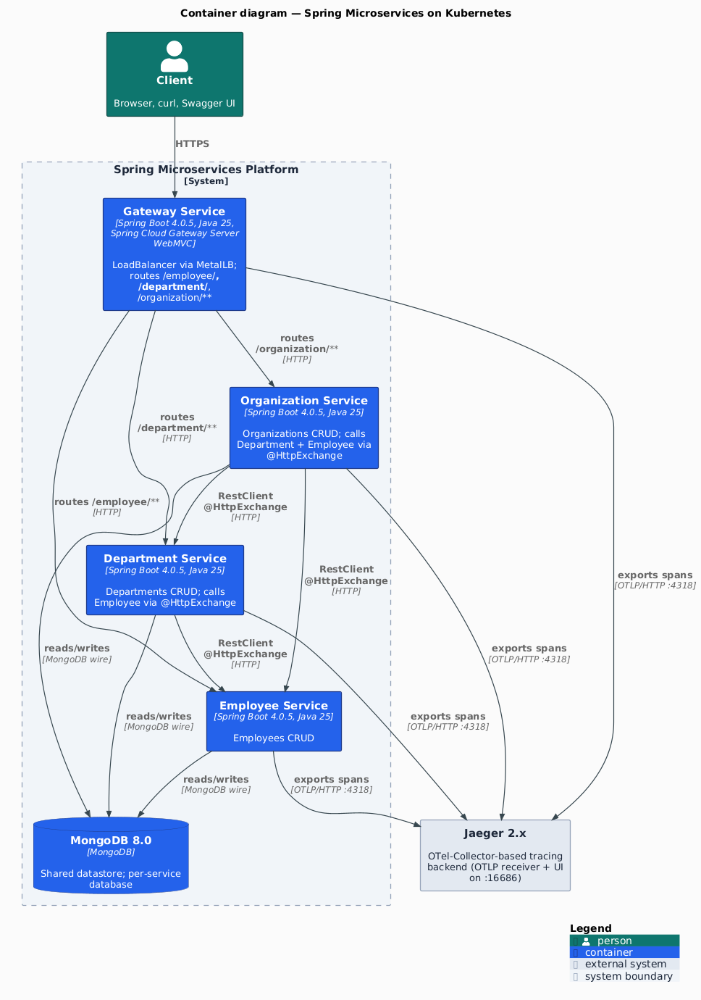
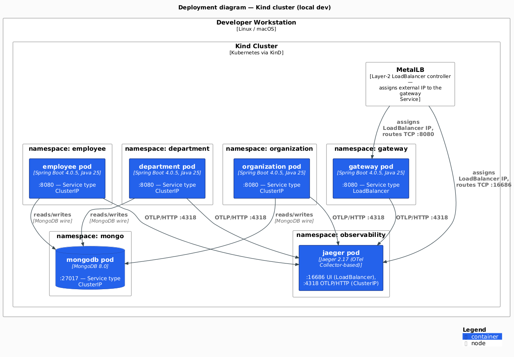

# Java Microservices with Spring Boot and Spring Cloud Kubernetes

## Abstract

This Reference Architecture demonstrates design, development, and deployment of
[Spring Boot](https://spring.io/projects/spring-boot) microservices on
Kubernetes. Each section covers architectural recommendations and configuration
for each concern when applicable.

High-level key recommendations:

- Consider Best Practices in Cloud Native Applications and [The 12
  Factor App](https://12factor.net/)
- Keep each microservice in a separate [Maven](https://maven.apache.org/) project
- Prefer using dependencies when inheriting from parent project instead of using
  relative path
- Use [Spring Initializr](https://start.spring.io/) to generate a Spring Boot
  project structure

This architecture demonstrates a complex Cloud Native application that
addresses the following concerns:

- Externalized configuration using ConfigMaps, Secrets, and PropertySource
- Kubernetes API server access using ServiceAccounts, Roles, and RoleBindings
- Health checks using Application Probes (readinessProbe, livenessProbe, startupProbe)
- Reporting application state using Spring Boot Actuators
- Service discovery across namespaces using DiscoveryClient
- Exposing API documentation using SpringDoc OpenAPI / Swagger UI
- Building a Docker image using best practices
- Layering JARs using the Spring Boot plugin
- Observing the application using Prometheus exporters

## Tech Stack

| Component | Version |
|-----------|---------|
| Java | 25 |
| Spring Boot | 4.0.5 |
| Spring Cloud | 2025.1.1 |
| Spring Cloud Kubernetes | 5.x (via 2025.1.1) |
| Spring Cloud Gateway Server WebMVC | 5.0.x |
| RestClient + @HttpExchange | Spring 7.x (native) |
| Micrometer Tracing | OpenTelemetry bridge (`micrometer-tracing-bridge-otel`) |
| Testcontainers | 2.0.x (managed by Spring Boot BOM) |
| Spring Cloud LoadBalancer | 5.0.x |
| SpringDoc OpenAPI | 3.0.2 |
| MongoDB | 8.0.20 (official `mongo` image, non-root UID 999) |
| Kubernetes | 1.35.0 (Kind node image, pinned) |
| Kind | 0.31.0 |
| MetalLB | 0.15.3 |

## Reference Architecture

The reference architecture demonstrates an organization where each unit has its
own application designed using a microservices architecture. Microservices are
exposed as REST APIs utilizing Spring Boot in an embedded Tomcat server and
deployed on Kubernetes.

Each microservice is deployed in its own namespace. Placing microservices in
separate namespaces allows logical grouping that makes it easier to manage
access privileges. Spring Cloud Kubernetes Discovery Client makes internal
communication between microservices seamless by communicating with the
Kubernetes API to discover the IPs of all services running in Pods.

The application is built with these open source components:

- [Spring Cloud Kubernetes](https://github.com/spring-cloud/spring-cloud-kubernetes):
  Integration with the Kubernetes API server for service discovery,
  configuration and load balancing.
- [Spring Cloud Gateway Server WebMVC](https://docs.spring.io/spring-cloud-gateway/reference/spring-cloud-gateway-server-webmvc.html):
  Servlet-based API gateway for routing requests to microservices (renamed from
  "Spring Cloud Gateway MVC" in SC Gateway 5.0).
- [RestClient](https://docs.spring.io/spring-framework/reference/integration/rest-clients.html#rest-http-interface) with `@HttpExchange`: Native Spring declarative HTTP client for inter-service communication, integrated with Spring Cloud LoadBalancer.
- [Spring Cloud LoadBalancer](https://docs.spring.io/spring-cloud-commons/reference/spring-cloud-commons/loadbalancer.html):
  Client-side load balancing via Kubernetes service discovery.
- [SpringDoc OpenAPI](https://springdoc.org/): OpenAPI 3 documentation with
  Swagger UI.

<p align="center"></p>

Source: [`diagrams/c4-container.puml`](diagrams/c4-container.puml) — PlantUML + C4-PlantUML, modern flat theme.

## Reference Architecture Environment

Each microservice runs in its own container, one container per pod and one pod
per service replica. The application uses a microservices architecture
with replicated containers calling each other.

<p align="center"></p>

Source: [`diagrams/c4-deployment.puml`](diagrams/c4-deployment.puml) — PlantUML + C4-PlantUML, modern flat theme.

## Spring Cloud Kubernetes

Spring Cloud Kubernetes provides Spring Cloud implementations of common
interfaces that consume Kubernetes native services. This Reference Architecture
uses only **one** feature from the library, deliberately keeping the surface
small:

- Cross-namespace service discovery via `DiscoveryClient`, consumed by the
  gateway's `lb()` filter (see "Configure Gateway Service") and by inter-service
  `@HttpExchange` clients

Two features documented in earlier revisions of this doc were **removed**
during the Spring Boot 4 / Spring Cloud 2025.1 migration because they are
broken under SC Kubernetes 5.x or no longer needed:

- **ConfigMap property sourcing via `spring.config.import: "optional:kubernetes:"`** —
  the informer-based loader does not publish the PropertySource before the
  `MongoClient` bean is instantiated, so `spring.mongodb.*` properties were
  silently falling back to defaults. Configuration that used to live in
  ConfigMaps is now injected directly into the Deployment via `envFrom` /
  `valueFrom.configMapKeyRef` — see "Configure Spring Cloud Kubernetes"
  below for the current pattern.
- **Secret file mounts via `spring.cloud.kubernetes.secrets.paths`** — same
  timing issue as ConfigMaps, plus mounted secret files are strictly worse
  than `valueFrom.secretKeyRef` for attack-surface reasons. Credentials are
  now injected as env vars — see "Configure MongoDB" below.

The small set of Spring Cloud Kubernetes features the project still uses
fits in three lines of `application.yml` (shown here for the employee
service — every backend service has the same block):

```yaml
spring:
  application:
    name: employee
  cloud:
    kubernetes:
      discovery:
        all-namespaces: true
```

The same `all-namespaces` flag is also present in each service's ConfigMap
(e.g., `spring.cloud.kubernetes.discovery.all-namespaces: "true"` in
`department-configmap.yaml`) — the ConfigMap value acts as an environment
override, ensuring discovery works even if the `application.yml` property
is overridden or missing at runtime.

## Source Code Directory Structure

```
spring-microservices-k8s/
├── department-service/    # Department microservice (calls Employee via RestClient)
│   └── src/
├── employee-service/      # Employee microservice (base CRUD service)
│   └── src/
├── gateway-service/       # API gateway (Spring Cloud Gateway MVC)
│   └── src/
├── organization-service/  # Organization microservice (calls Dept + Employee)
│   └── src/
├── k8s/                   # Kubernetes manifests, Kind + MetalLB configs
├── e2e/                   # End-to-end test script
├── docs/                  # Architecture documentation and diagrams
├── Makefile               # Build orchestration (run `make help`)
├── pom.xml                # Parent POM (multi-module)
└── renovate.json          # Renovate dependency update configuration
```

## Quick Start

```bash
make deps          # check required tools
make kind-up       # full lifecycle: Kind + MetalLB + MongoDB + 4 services
make e2e-test      # run end-to-end API tests
make gateway-open  # open Swagger UI in browser
make kind-down     # tear everything down
```

`kind-up` is a docker-compose-style alias for `kind-deploy` that chains
`kind-create` → `kind-setup` → `image-build` → `image-load` → service
deployment in one command. See the per-step targets below if you need
granular control.

## Enable Spring Cloud Kubernetes

Add the following dependency to enable Spring Cloud Kubernetes cross-namespace
discovery. The `kubernetes-client-all` starter uses the official
[`kubernetes-client`](https://github.com/kubernetes-client/java) Java library
(as opposed to the fabric8 variant) and pulls in the `DiscoveryClient`
implementation.

```xml
<dependency>
    <groupId>org.springframework.cloud</groupId>
    <artifactId>spring-cloud-starter-kubernetes-client-all</artifactId>
</dependency>
```

The service-level `application.yml` opts into cross-namespace discovery via a
single property:

```yaml
# application.yml
spring:
  application:
    name: department
  cloud:
    kubernetes:
      discovery:
        all-namespaces: true
```

That is the entirety of the Spring Cloud Kubernetes configuration. Everything
else (MongoDB connection URLs, credentials, metrics/tracing knobs) is injected
via plain Kubernetes `env` on the Deployment — see "Configure MongoDB" below
for the `valueFrom` pattern.

## Enable Service Discovery Across All Namespaces

The `all-namespaces: true` setting in `application.yml` enables cross-namespace
discovery. This allows the gateway and inter-service RestClient calls to find
services deployed in different namespaces.

Application classes are minimal under Spring Boot auto-configuration — no
`@EnableDiscoveryClient`, `@EnableMongoRepositories`, or `@EnableSwagger2`
annotations are needed.

`/department-service/src/main/java/.../DepartmentApplication.java`

```java
@SpringBootApplication
public class DepartmentApplication {

    public static void main(String[] args) {
        SpringApplication.run(DepartmentApplication.class, args);
    }

    @Bean
    MeterRegistryCustomizer<MeterRegistry> meterRegistryCustomizer() {
        return registry -> registry.config()
                .commonTags("application", "department");
    }
}
```

RestClient with `@HttpExchange` is a native Spring declarative HTTP client. To
communicate with `employee-service` from `department-service`, create an
interface annotated with `@HttpExchange`. The service name `"employee"` is
resolved at runtime via Spring Cloud Kubernetes DiscoveryClient and
Spring Cloud LoadBalancer.

`/department-service/src/main/java/.../client/EmployeeClient.java`

```java
public interface EmployeeClient {
    @GetExchange("/department/{departmentId}")
    List<Employee> findByDepartment(@PathVariable("departmentId") String departmentId);
}
```

ConfigMaps are still used to hold the non-secret runtime values (MongoDB host,
database name, observability knobs), but they are **consumed by the Deployment
via `valueFrom.configMapKeyRef`** rather than by Spring Cloud Kubernetes's
built-in ConfigMap loader. This bypasses a known timing bug in the SC
Kubernetes 5.x informer-based loader where `MongoClient` instantiates before
the PropertySource is registered. See the "Configure MongoDB" section below
for the Deployment-side wiring.

`/k8s/department-configmap.yaml`

```yaml
kind: ConfigMap
apiVersion: v1
metadata:
  name: department
data:
  logging.pattern.console: "%clr(%d{yy-MM-dd E HH:mm:ss.SSS}){blue} ..."
  spring.cloud.kubernetes.discovery.all-namespaces: "true"
  # Keys retain the Spring Boot 3.x `spring.data.mongodb.*` prefix — they
  # are lookup keys for the Deployment's `valueFrom.configMapKeyRef`, not
  # property names. The env-var names (`SPRING_MONGODB_*`) target the new
  # Spring Boot 4 `spring.mongodb.*` prefix via relaxed binding.
  spring.data.mongodb.database: "admin"
  spring.data.mongodb.host: "mongodb.mongo.svc.cluster.local"
  management.endpoints.web.exposure.include: "health,info,metrics,prometheus"
  management.metrics.enable.all: "true"
  management.metrics.distribution.percentiles-histogram.http.server.requests: "true"
  management.metrics.distribution.slo.http.server.requests: "1ms,5ms"
  management.tracing.sampling.probability: "1.0"
```

## Configure Spring Cloud Kubernetes to Access Kubernetes API

Spring Cloud Kubernetes requires access to the Kubernetes API to retrieve
service endpoints. A `ClusterRole` defines the required permissions:

`/k8s/rbac-cluster-role.yaml`

```yaml
kind: ClusterRole
apiVersion: rbac.authorization.k8s.io/v1
metadata:
  namespace: default
  name: microservices-kubernetes-namespace-reader
rules:
  - apiGroups: [""]
    resources: ["configmaps", "pods", "services", "endpoints", "secrets"]
    verbs: ["get", "list", "watch"]
```

The Makefile's `kind-setup` target automatically creates namespaces, service
accounts, and cluster role bindings:

```bash
make kind-setup
```

This creates 5 namespaces (department, employee, gateway, organization, mongo),
a service account `api-service-account` in each, and binds them to the
ClusterRole. All deployment manifests reference this service account.

## Kubernetes Service Naming

Every Service in the cluster is assigned a DNS name following the pattern
`<service>.<namespace>.svc.cluster.local`. For example, the MongoDB service
is reachable at `mongodb.mongo.svc.cluster.local:27017`.

| Service | FQDN | Port | Type |
|---------|------|-----:|------|
| gateway | `gateway.gateway.svc.cluster.local` | 8080 | LoadBalancer |
| employee | `employee.employee.svc.cluster.local` | 8080 | ClusterIP |
| department | `department.department.svc.cluster.local` | 8080 | ClusterIP |
| organization | `organization.organization.svc.cluster.local` | 8080 | ClusterIP |
| mongodb | `mongodb.mongo.svc.cluster.local` | 27017 | ClusterIP |

The pattern is `<service>.<namespace>.svc.cluster.local:<port>`.

## Configure MongoDB

MongoDB 8 runs as a single-replica deployment in the `mongo` namespace.

`/k8s/mongodb-deployment.yaml` (abbreviated)

```yaml
apiVersion: apps/v1
kind: Deployment
metadata:
  name: mongodb
spec:
  replicas: 1
  template:
    spec:
      securityContext:
        # Official mongo image runs as the `mongodb` user (UID 999).
        runAsNonRoot: true
        runAsUser: 999
        runAsGroup: 999
        fsGroup: 999
        seccompProfile:
          type: RuntimeDefault
      containers:
        - name: mongodb
          image: mongo:8.0.20
          securityContext:
            allowPrivilegeEscalation: false
            readOnlyRootFilesystem: false
            capabilities:
              drop:
                - ALL
          ports:
            - containerPort: 27017
          env:
            # Official mongo image uses MONGO_INITDB_* env vars.
            - name: MONGO_INITDB_DATABASE
              valueFrom:
                configMapKeyRef:
                  name: mongodb
                  key: database-name
            - name: MONGO_INITDB_ROOT_USERNAME
              valueFrom:
                secretKeyRef:
                  name: mongodb
                  key: database-user
            - name: MONGO_INITDB_ROOT_PASSWORD
              valueFrom:
                secretKeyRef:
                  name: mongodb
                  key: database-password
          resources:
            requests:
              cpu: "0.2"
              memory: 300Mi
            limits:
              cpu: "1.0"
              memory: 300Mi
      serviceAccountName: api-service-account
```

Credentials are stored in a Kubernetes Secret (base64-encoded):

```yaml
apiVersion: v1
kind: Secret
metadata:
  name: mongodb
type: Opaque
data:
  database-user: bW9uZ28tYWRtaW4=           # mongo-admin
  database-password: bW9uZ28tYWRtaW4tcGFzc3dvcmQ=  # mongo-admin-password
```

## Inject MongoDB Connection via Environment Variables

Each backend service's Deployment wires the MongoDB host, database, and
credentials as plain Kubernetes environment variables using
`valueFrom.configMapKeyRef` + `valueFrom.secretKeyRef`. Spring Boot's relaxed
binding then maps each `SPRING_MONGODB_*` env var onto the corresponding
`spring.mongodb.*` property that `MongoProperties` reads at startup.

Why env-var injection instead of the Spring Cloud Kubernetes ConfigMap /
Secret loaders:

1. **Timing**: SC Kubernetes 5.x registers its ConfigMap / Secret
   `PropertySource` asynchronously after the informer cache warms up. On a
   cold start, the `MongoClient` bean is instantiated before the properties
   become visible, silently falling back to `localhost:27017`.
2. **Property prefix change**: Spring Boot 4 split `MongoProperties` into
   two `@ConfigurationProperties` classes. Connection settings moved from
   `spring.data.mongodb.*` to **`spring.mongodb.*`**, while Spring Data's
   own knobs (auto-index creation, gridfs, …) stayed under the old prefix.
   Injecting env vars is the simplest way to target the new prefix without
   renaming existing ConfigMap/Secret keys.
3. **Attack surface**: env-var injection from a Secret is strictly less
   surface than mounting the Secret as files into the container filesystem
   — nothing else in the image can read the credentials.

`/k8s/department-deployment.yaml` (abbreviated)

```yaml
spec:
  containers:
    - name: department
      image: department:local
      env:
        - name: SPRING_MONGODB_HOST
          valueFrom:
            configMapKeyRef:
              name: department
              key: spring.data.mongodb.host
        - name: SPRING_MONGODB_DATABASE
          valueFrom:
            configMapKeyRef:
              name: department
              key: spring.data.mongodb.database
        - name: SPRING_MONGODB_USERNAME
          valueFrom:
            secretKeyRef:
              name: department
              key: spring.data.mongodb.username
        - name: SPRING_MONGODB_PASSWORD
          valueFrom:
            secretKeyRef:
              name: department
              key: spring.data.mongodb.password
```

The ConfigMap key names still use the Spring Boot 3.x `spring.data.mongodb.*`
prefix because they're just lookup keys — they are never interpreted as
property names. The **env var names** (`SPRING_MONGODB_*`) are what Spring
Boot's relaxed binding reads, and those target the Spring Boot 4
`spring.mongodb.*` prefix.

## Use Spring Boot Actuator to Export Metrics for Prometheus

[Prometheus](https://prometheus.io/) monitoring integrates through
[Micrometer](http://micrometer.io/) and Spring Boot Actuator.

Maven dependencies:

```xml
<dependency>
    <groupId>org.springframework.boot</groupId>
    <artifactId>spring-boot-starter-actuator</artifactId>
</dependency>
<dependency>
    <groupId>io.micrometer</groupId>
    <artifactId>micrometer-registry-prometheus</artifactId>
</dependency>
```

Each service registers a `MeterRegistryCustomizer` bean with a common tag for
Grafana dashboards:

```java
@Bean
MeterRegistryCustomizer<MeterRegistry> meterRegistryCustomizer() {
    return registry -> registry.config()
            .commonTags("application", "department");
}
```

Metrics endpoints are exposed via ConfigMap:

```yaml
management.endpoints.web.exposure.include: "health,info,metrics,prometheus"
management.metrics.enable.all: "true"
```

Endpoints: `/actuator/metrics` and `/actuator/prometheus`.

## Distributed Tracing with Micrometer + Jaeger

Micrometer Tracing (replacing Spring Cloud Sleuth) provides distributed trace
context propagation across services. Trace IDs are automatically propagated
via HTTP headers through RestClient and Spring MVC.

Dependencies (managed by Spring Boot BOM):

```xml
<dependency>
    <groupId>io.micrometer</groupId>
    <artifactId>micrometer-tracing-bridge-otel</artifactId>
</dependency>
<dependency>
    <groupId>io.opentelemetry</groupId>
    <artifactId>opentelemetry-exporter-otlp</artifactId>
</dependency>
```

The project uses the **OpenTelemetry bridge** (`micrometer-tracing-bridge-otel`)
rather than the legacy Brave / Zipkin bridge. This is the industry-standard
target for observability consolidation and works with any OTLP-compatible
backend (Tempo, Jaeger, Honeycomb, Datadog, …).

Spans are exported over OTLP/HTTP to an in-cluster **Jaeger 2.x**
Deployment in the `observability` namespace. Jaeger v2 is built on the
OpenTelemetry Collector and is configured via a YAML file mounted from
[`k8s/jaeger-config.yaml`](../k8s/jaeger-config.yaml) (in-memory storage,
OTLP receivers on 4317/4318, query UI on 16686). Each service ConfigMap
sets:

```yaml
management.tracing.sampling.probability: "1.0"
management.otlp.tracing.endpoint: "http://jaeger.observability.svc.cluster.local:4318/v1/traces"
```

Jaeger exposes its UI via a MetalLB LoadBalancer on port 16686 — open it with
`make jaeger-open`. The sampling rate is 100% because this is a local dev
cluster; in production you would lower the probability (e.g. `"0.1"`) or
configure tail-based sampling at a collector.

To swap Jaeger for another OTLP backend (Tempo, Honeycomb, Datadog), change
only the `management.otlp.tracing.endpoint` value in each ConfigMap — no code
or dependency changes are required.

## Integration Testing with Testcontainers

Each backend service includes integration tests using
[Testcontainers](https://testcontainers.com/) with a real MongoDB instance.
Tests run during `make test` — no Kubernetes cluster required.

```bash
make test    # runs Testcontainers-based integration tests
make e2e     # runs full Kind cluster end-to-end tests
```

Tests use `@SpringBootTest` with `@ServiceConnection` for automatic MongoDB
container lifecycle management. Spring Cloud Kubernetes is disabled during
tests via an `application-test.yml` profile.

## Static Analysis and Code Quality

The project enforces code quality through a composite `static-check` target
that runs all checks in sequence. Each check is also available as an
individual target.

| Check | Tool | What it catches |
|-------|------|-----------------|
| Code formatting | [google-java-format](https://github.com/google/google-java-format) | Inconsistent formatting (matched to `google_checks.xml`) |
| Compiler warnings | `maven-compiler-plugin` with `failOnWarning=true` | Unused imports, raw types, deprecation |
| Java style | Checkstyle with `google_checks.xml` | Style violations, naming conventions |
| Dockerfile linting | [hadolint](https://github.com/hadolint/hadolint) | Dockerfile anti-patterns |
| Secret scanning | [gitleaks](https://github.com/zricethezav/gitleaks) | Accidentally committed credentials |
| GitHub Actions linting | [actionlint](https://github.com/rhysd/actionlint) (with shellcheck) | YAML schema errors, shell scripts inside `run:` blocks |
| Filesystem CVE scan | [Trivy](https://github.com/aquasecurity/trivy) (fs scanner) | Vulnerabilities, secrets, and misconfigurations in source + deps |
| K8s manifest scan | Trivy (config scanner) | KSV-* Kubernetes security misconfigurations |
| PlantUML drift check | `plantuml/plantuml` | Committed PNGs in `docs/diagrams/out/` drift from `.puml` source when contributors edit the source without re-rendering |

Run all checks:

```bash
make static-check    # format-check + lint-ci + lint + lint-docker + secrets + trivy-fs + trivy-config + diagrams-check
make cve-check       # OWASP Dependency-Check — slower, runs in its own CI job
make deps-prune      # check for unused Maven dependencies
make deps-prune-check # CI gate version — fails on unused or undeclared deps
```

The CI workflow runs `static-check` as the first job — format, lint, security,
and diagram errors are caught before `build` or `test` run.

## Build Docker Images

Each service has its own `Dockerfile` that consumes a **pre-built** Spring
Boot JAR (produced by `mvn install` running on the host or in the `build`
CI job). The Dockerfile itself does not run Maven — that decouples image
build time from Maven repository availability and keeps the image layer
layout focused on runtime concerns.

Key properties of the runtime image:

- **Multi-stage build** — the first stage runs `java -Djarmode=layertools`
  to extract the Spring Boot layered JAR; the second stage copies those
  layers into a clean runtime image
- **Eclipse Temurin 25 JRE on Ubuntu Noble** (`eclipse-temurin:25-jre-noble`)
  — the `-jre-noble` variant ships a minimal Ubuntu 24.04 LTS base with only
  the JRE, keeping the image size modest while still providing a usable
  shell for debugging
- **Non-root with a numeric UID** (`useradd -r -u 10001`) — Kubernetes's
  restricted Pod Security Standard requires `runAsNonRoot: true` to be
  verifiable from the manifest, which needs a numeric UID in the image
- **Spring Boot layered JAR** — application code is in its own layer so
  cache churn is dominated by `dependencies` (rarely changes) rather than
  `application` (changes every build)

`gateway-service/Dockerfile` (all 4 services are structurally identical):

```dockerfile
# Runtime Dockerfile — uses pre-built JAR from Maven build
# For local builds: run `make build` first, then `make image-build`
# For CI: the builds job produces JARs before Docker builds

FROM eclipse-temurin:25-jre-noble AS extract
WORKDIR /tmp
COPY target/*.jar app.jar
RUN java -Djarmode=layertools -jar app.jar extract

FROM eclipse-temurin:25-jre-noble AS runtime

RUN groupadd -r appuser && useradd -r -g appuser -u 10001 -d /application appuser
USER 10001
WORKDIR /application

COPY --from=extract --chown=appuser:appuser /tmp/dependencies/ ./
COPY --from=extract --chown=appuser:appuser /tmp/snapshot-dependencies/ ./
COPY --from=extract --chown=appuser:appuser /tmp/spring-boot-loader/ ./
COPY --from=extract --chown=appuser:appuser /tmp/application/ ./

EXPOSE 8080

ENV JAVA_TOOL_OPTIONS="-XX:MinRAMPercentage=60.0 -XX:MaxRAMPercentage=90.0 \
-Djava.awt.headless=true -Dfile.encoding=UTF-8 \
-Dspring.output.ansi.enabled=ALWAYS"

# HEALTHCHECK: not needed — Kubernetes startup/readiness/liveness probes
# handle health checks. For standalone Docker use, add:
# HEALTHCHECK CMD ["curl","-sf","http://localhost:8080/actuator/health"]
ENTRYPOINT ["java", "org.springframework.boot.loader.launch.JarLauncher"]
```

Build all service images with:

```bash
make build         # mvn install — produces the layered JAR in each */target/
make image-build   # docker buildx build for all 4 services
```

Spring Boot's layered-JAR extractor produces these four layers, ordered from
rarest-churn to most-frequent-churn:

- `dependencies` — third-party libraries (rarely change)
- `snapshot-dependencies` — snapshot versions (rare for release builds)
- `spring-boot-loader` — Spring Boot launcher (changes only on SB version bumps)
- `application` — your code (changes every build)

Use [Dive](https://github.com/wagoodman/dive) to analyze image layers:
`dive gateway:local`.

## Deploy a Spring Boot Application

Deployment manifests specify resource limits, health probes, and service
account references. Key deployment recommendations:

- Always specify `resources.requests` and `resources.limits`
- Keep memory requests equal to limits (RAM is not compressible)
- Use **startupProbe** to handle slow JVM startup without premature restarts
- Use **readinessProbe** to gate traffic until the app is ready
- Use **livenessProbe** conservatively — only restart when truly stuck

```yaml
apiVersion: apps/v1
kind: Deployment
metadata:
  name: department
spec:
  replicas: 1
  template:
    spec:
      securityContext:
        runAsNonRoot: true
        seccompProfile:
          type: RuntimeDefault
      containers:
        - name: department
          image: department:local
          imagePullPolicy: IfNotPresent
          securityContext:
            allowPrivilegeEscalation: false
            readOnlyRootFilesystem: true
            capabilities:
              drop:
                - ALL
          ports:
            - containerPort: 8080
          resources:
            requests:
              cpu: "0.2"
              memory: 1Gi
            limits:
              cpu: "1.0"
              memory: 1Gi
          startupProbe:
            httpGet:
              port: 8080
              path: /actuator/health
            initialDelaySeconds: 30
            periodSeconds: 10
            failureThreshold: 20
          readinessProbe:
            httpGet:
              port: 8080
              path: /actuator/health
            initialDelaySeconds: 0
            timeoutSeconds: 5
            periodSeconds: 10
            failureThreshold: 3
          livenessProbe:
            httpGet:
              port: 8080
              path: /actuator/info
            initialDelaySeconds: 0
            timeoutSeconds: 5
            periodSeconds: 20
            failureThreshold: 5
          volumeMounts:
            - name: tmp
              mountPath: /tmp
      volumes:
        - name: tmp
          emptyDir: {}
      serviceAccountName: api-service-account
```

Deploy all services:

```bash
make kind-deploy
```

View deployed resources with `kubectl get all -n department`.

## Configure Gateway Service

The gateway service uses Spring Cloud Gateway Server WebMVC (servlet-based) to
route requests to backend microservices. Routes are defined programmatically
using `RouterFunction` beans with load balancer integration:

`/gateway-service/src/main/java/.../GatewayApplication.java`

```java
@SpringBootApplication
public class GatewayApplication {

    private static final String EMPLOYEE_SERVICE = "employee";
    private static final String DEPARTMENT_SERVICE = "department";
    private static final String ORGANIZATION_SERVICE = "organization";

    @Autowired DiscoveryClient client;

    @PostConstruct
    public void init() {
        LOGGER.info("Services: {}", client.getServices());
        // logs each service instance's host, port, and ID at startup
    }

    @Bean
    public RouterFunction<ServerResponse> employeeRoute() {
        return route(EMPLOYEE_SERVICE)
                .route(path("/" + EMPLOYEE_SERVICE, "/" + EMPLOYEE_SERVICE + "/**"),
                       HandlerFunctions.http())
                .before(stripPrefix(1))
                .filter(lb(EMPLOYEE_SERVICE))
                .build();
    }

    // departmentRoute() and organizationRoute() follow the same pattern
}
```

- `path(...)` matches incoming request paths
- `stripPrefix(1)` removes the service prefix (e.g., `/employee/1` → `/1`)
- `lb(EMPLOYEE_SERVICE)` resolves the service via Spring Cloud LoadBalancer
  using Kubernetes DiscoveryClient
- The `@PostConstruct init()` logs all discovered service instances at startup
  — useful for debugging cross-namespace discovery

SpringDoc aggregates API docs from all backend services:

```yaml
# gateway application.yml
springdoc:
  swagger-ui:
    urls:
      - name: employee
        url: /employee/v3/api-docs
      - name: department
        url: /department/v3/api-docs
      - name: organization
        url: /organization/v3/api-docs
```

The gateway service type is `LoadBalancer` — MetalLB assigns an external IP
for local development on Kind.

## Gateway Swagger UI

Swagger UI is exposed on the gateway service at `/swagger-ui.html` and
aggregates API documentation from all backend services across namespaces.

Open Swagger UI with `make gateway-open` or navigate to `http://<gateway-ip>:8080/swagger-ui.html`.

## Local Development with Kind + MetalLB

The project uses [Kind](https://kind.sigs.k8s.io/) (Kubernetes in Docker) with
[MetalLB](https://metallb.universe.tf/) for local LoadBalancer support, replacing
the previous Minikube + VirtualBox setup. The Kind node image is pinned
(`KIND_NODE_IMAGE := v1.35.0` in the Makefile, Renovate-tracked) so every
`make kind-up` gets identical Kubernetes across machines and CI runners.

Two tiers of targets — `kind-up` / `kind-down` for the common "just bring
the stack up" and "tear it down" flows, and granular targets for
step-through debugging:

```bash
# Common flow
make kind-up       # create cluster + MetalLB + setup + image-build + deploy
make e2e-test      # run the end-to-end HTTP test suite via the gateway LB
make kind-down     # tear the whole cluster down

# Granular (for debugging, partial rebuilds, etc.)
make kind-create   # creates Kind cluster + installs MetalLB
make kind-setup    # namespaces, RBAC, service accounts, MongoDB
make kind-deploy   # builds images, loads into Kind, deploys all services
make kind-redeploy # kind-undeploy + kind-deploy (reapply app manifests only)
make kind-undeploy # remove service manifests but keep the cluster running
make kind-destroy  # delete the cluster
```

The fully-scripted end-to-end cycle (`make e2e`) runs
`kind-create` → `kind-setup` → `kind-deploy` → `e2e-test` → `kind-destroy`
in sequence — useful for one-shot CI validation where the cluster should
not survive the test run.

## End-to-End Testing

The `e2e/e2e-test.sh` script validates the entire stack:

1. **Gateway health** — `/actuator/health` returns `UP`
2. **Create employees** — POST 2 employees through gateway → employee service → MongoDB
3. **List employees** — GET verifies both employees stored
4. **Create department** — POST through gateway → department service → MongoDB
5. **List departments** — GET verifies department stored
6. **Create organization** — POST through gateway → organization service → MongoDB
7. **Cross-service: org with employees** — GET triggers organization → RestClient → employee
8. **Cross-service: org with departments** — GET triggers organization → RestClient → department

Example cross-service response:

```json
{
  "id": "1",
  "name": "MegaCorp",
  "address": "Main Street",
  "departments": [
    {
      "id": "1",
      "name": "RD Dept.",
      "employees": [
        { "id": "1", "name": "Smith", "age": 25, "position": "engineer" },
        { "id": "2", "name": "Johns", "age": 45, "position": "manager" }
      ]
    }
  ],
  "employees": [
    { "id": "1", "name": "Smith", "age": 25, "position": "engineer" },
    { "id": "2", "name": "Johns", "age": 45, "position": "manager" }
  ]
}
```

## CI/CD

GitHub Actions runs on every push to `master`, tags `v*`, and pull requests.

| Job | Triggers | Steps |
|-----|----------|-------|
| **static-check** | push, PR | `make static-check` composite gate: format-check, lint-ci (actionlint), lint (Checkstyle + compiler warnings-as-errors), lint-docker (hadolint), secrets (gitleaks), trivy-fs, trivy-config, diagrams-check |
| **build** | after static-check | Build all modules with Maven, upload JARs as `service-jars` artifact |
| **test** | after static-check | Run Testcontainers integration tests + coverage |
| **cve-check** | push to master AND tag pushes (skipped under `act`) | OWASP dependency vulnerability scan — gates the `docker` job on tag pushes |
| **image-scan** | every push (matrix: 4 services) | Per-service Dockerfile validation gates 1–3: build single-arch image → Trivy image scan (CRITICAL/HIGH blocking) → Spring Boot boot-marker smoke test |
| **e2e** | every push (skipped under `act`) | End-to-end test against a full Kind + MetalLB stack: `make e2e` cycles create → setup (MongoDB) → deploy (4 services + gateway LB) → `./e2e/e2e-test.sh` → destroy |
| **docker** | tag push only (matrix: 4 services) | Full pre-push hardening: build local image → Trivy image scan → Spring Boot smoke test → multi-arch (amd64+arm64) build with SLSA provenance + SBOM attestation → push to GHCR → cosign keyless OIDC signing |
| **ci-pass** | always | Branch-protection aggregator: single required status check that verifies no upstream job failed. Skipped jobs do not trip the gate. |

The release-time `docker` job is documented in detail in the
[README](../README.md#pre-push-image-hardening) under "Pre-push image
hardening". Verify a published image's cosign signature with:

```bash
cosign verify ghcr.io/AndriyKalashnykov/spring-microservices-k8s/gateway:<tag> \
  --certificate-identity-regexp 'https://github\.com/AndriyKalashnykov/spring-microservices-k8s/.+' \
  --certificate-oidc-issuer https://token.actions.githubusercontent.com
```

A weekly [cleanup workflow](.github/workflows/cleanup-runs.yml) prunes old
workflow runs and stale caches.
[Renovate](https://docs.renovatebot.com/) keeps dependencies up to date with
platform automerge enabled.
